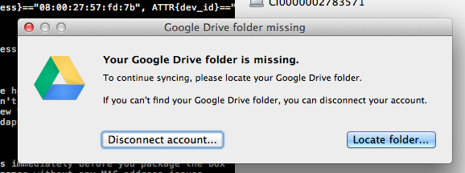

After I recently moved all my local software project's repos into my Google Drive folder I started
to notice problems with some of my Vim plug-ins. The problems were due to the fact that the Google
Drive folder has a space in it. So instead of doing what a good person should probably do and figure
out why Vim wasn't escaping the space in the folder name I tried to just remove the space. A quick
scan of Google Drive preferences didn't show any signs of the ability to change the folder name and
when I tried to rename it in Finder I got an error. It turns out you just have to close the Google
Drive app and then rename it.

### Renaming Google Drive Folder in OS X

1. Close Google Drive App

2. Rename Google Drive Folder

        mv /Users/brandon/Google\ Drive /Users/brandon/GoogleBadassDrive

3. Start Google Drive. You should see the below error message.

    

4. Click the Error at the top of the Google Drive menu.

    

5. Then hit the "Locate folder..." button.

    

6. Finally select the renamed Google Drive folder and you are back in action.
